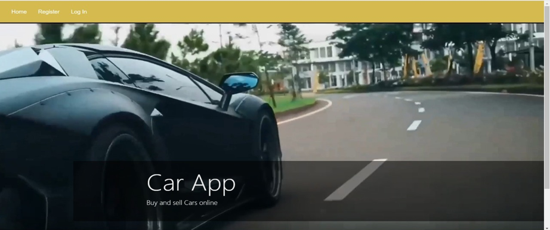

# carApps

Implemented using Java Spring Boot, oracle database, angular, html, css, typescript

Car App is an application in which we can choose the car based on
brand and color and not only buying we can also sell the car we can

service the car also without going out physically to check which show-
room is good.An Car App is secure,reliable and easy to use by this the

user will feel comfortable whenever he/she wants to buy,sell,service

their cars.The application interface is user friendly, and it can be ac-
cessed easily on successful login.

### Screenshots

---

---

---

---

---

---

---

---

---

---

---

---

---
